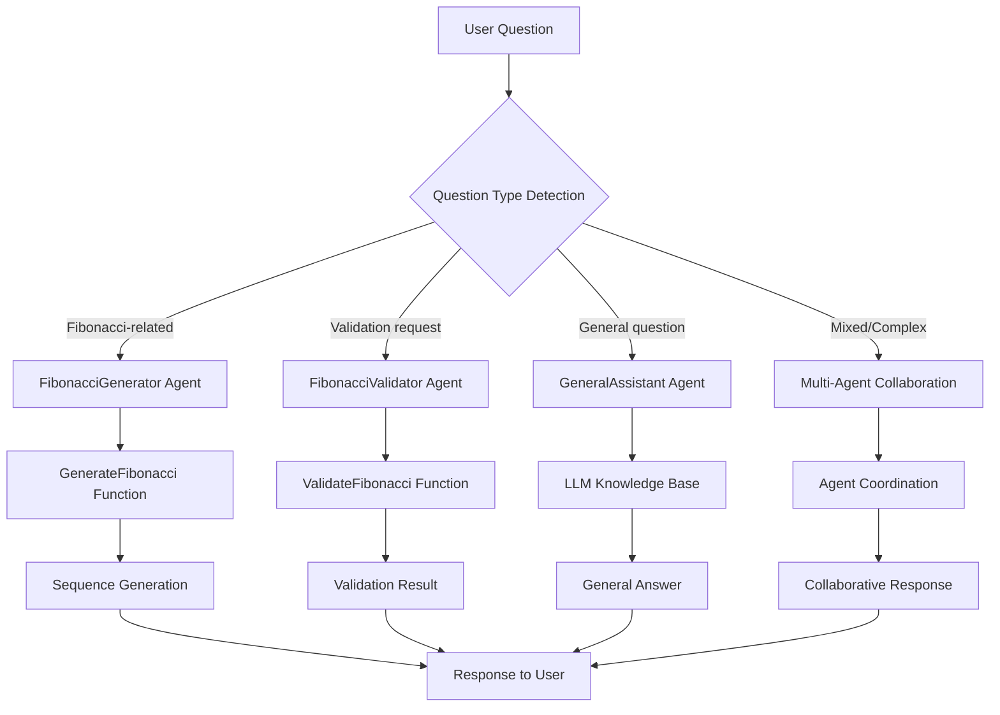

# Fibonacci Multi-Agent Workflow

This project demonstrates a declarative multi-agent workflow using the Semantic Kernel Agent Framework with an interactive conversational interface that can handle both Fibonacci-specific operations and general questions.

## Overview

The application implements three specialized AI agents that collaborate in an interactive chat environment:

1. **FibonacciGenerator**: Generates Fibonacci sequences and explains Fibonacci concepts
2. **FibonacciValidator**: Validates Fibonacci sequences for correctness
3. **GeneralAssistant**: Handles non-Fibonacci questions using the LLM's general knowledge

## Architecture

### Multi-Agent System

The system uses three specialized agents working together in an interactive chat environment:

- **FibonacciGenerator**: Generates Fibonacci sequences using kernel functions and explains Fibonacci concepts
- **FibonacciValidator**: Validates Fibonacci sequences for correctness and provides detailed feedback
- **GeneralAssistant**: Handles non-Fibonacci questions by leveraging the LLM model's general knowledge

The agents intelligently route questions to the appropriate specialist, creating a collaborative environment where each agent focuses on their area of expertise.

### Key Components

1. **FibonacciApp.cs**: Main application orchestrating the multi-agent conversational workflow
2. **FibonacciPlugin.cs**: Kernel plugin containing Fibonacci-related functions
3. **FibonacciAgentInstructions.cs**: Agent instruction definitions for all three agents
4. **FibonacciTerminationStrategy.cs**: Custom termination strategy for the agent group chat
5. **MockChatCompletionService.cs**: Mock chat completion service for demonstration
6. **fibonacci-agents.yaml**: Declarative YAML agent definitions (reference)

## Agent Workflow



## Available Functions

### FibonacciPlugin Functions

- **GenerateFibonacci(count)**: Generates first N Fibonacci numbers
- **ValidateFibonacci(sequence)**: Validates a sequence for Fibonacci correctness
- **GetFibonacciString(count)**: Returns formatted string of Fibonacci numbers
- **IsFibonacciNumber(number)**: Checks if a number is a Fibonacci number

## Setup

### Azure OpenAI Configuration

Before running the application, you'll need to configure Azure OpenAI settings. See the [Azure OpenAI Setup Guide](./docs/AZURE_OPENAI_SETUP.md) for detailed instructions on:

- Setting up your Azure OpenAI service
- Configuring API keys and endpoints
- Updating the `appsettings.json` file

## Usage

1. Build and run the application:

   ```bash
   dotnet build
   dotnet run
   ```

2. Choose option `2` for "Fibonacci Multi-Agent Workflow"

3. The application will start an interactive chat session where you can ask:
   - **Fibonacci questions**: "What are the first 10 Fibonacci numbers?"
   - **Validation questions**: "Is this sequence correct: 0, 1, 1, 2, 3, 5?"
   - **Individual number checks**: "Is 89 a Fibonacci number?"
   - **General questions**: "What is machine learning?" or "Explain photosynthesis"
   - **Mixed questions**: Questions that involve both Fibonacci and general concepts

4. Type `exit` to quit the application

## Interactive Features

The application now provides a rich conversational experience with:

- **Natural Language Processing**: Ask questions in plain English
- **Context Awareness**: Agents understand the context and route questions appropriately
- **Multi-Domain Support**: Seamlessly switch between Fibonacci-specific and general topics
- **Agent Coordination**: Multiple agents can collaborate on complex questions
- **Visual Feedback**: Different emojis (🔢, ✅, 🤖) identify which agent is responding
- **Graceful Termination**: Intelligent conversation management that knows when to stop

## Example Interactions

### Fibonacci Sequence Generation

```text
You: What are the first 8 Fibonacci numbers?

FibonacciGenerator 🔢: The first 8 Fibonacci numbers are: 0, 1, 1, 2, 3, 5, 8, 13

Each number is the sum of the two preceding numbers, starting with 0 and 1.
```

### Sequence Validation

```text
You: Is this sequence correct: 0, 1, 1, 2, 3, 5, 8?

FibonacciValidator ✅: ✅ VALID: The sequence [0, 1, 1, 2, 3, 5, 8] is a correct Fibonacci sequence.
This represents the first 7 numbers of the Fibonacci sequence.
```

### General Knowledge Questions

```text
You: What is the capital of France?

GeneralAssistant 🤖: The capital of France is Paris. It's located in the north-central part of France 
and is known for landmarks like the Eiffel Tower, Louvre Museum, and Notre-Dame Cathedral.
```

### Agent Collaboration

```text
You: Is 21 a Fibonacci number and what comes after it?

FibonacciValidator ✅: Yes, 21 is indeed a Fibonacci number! It's the 8th number in the sequence.

FibonacciGenerator 🔢: The number that comes after 21 in the Fibonacci sequence is 34 
(since 13 + 21 = 34). The sequence continues: ..., 13, 21, 34, 55, 89, ...
```

## Declarative Agent Definitions

The `fibonacci-agents.yaml` file demonstrates how these agents could be defined declaratively using YAML format, following the Semantic Kernel Agent Framework patterns:

```yaml
generator_agent:
  type: chat_completion_agent
  name: FibonacciGenerator
  description: Specialist agent for generating Fibonacci sequences
  instructions: |
    You are a Fibonacci sequence generator specialist...
  tools:
    - id: GenerateFibonacci
      type: function
      description: Generates the first N numbers of the Fibonacci sequence

validator_agent:
  type: chat_completion_agent
  name: FibonacciValidator
  description: Specialist agent for validating Fibonacci sequences
  instructions: |
    You are a Fibonacci sequence validation specialist...
  tools:
    - id: ValidateFibonacci
      type: function
      description: Validates if a sequence follows Fibonacci rules

general_agent:
  type: chat_completion_agent
  name: GeneralAssistant
  description: General-purpose assistant for non-Fibonacci questions
  instructions: |
    You are a helpful general assistant that can answer questions on any topic...
```

## Key Features Demonstrated

1. **Multi-Agent Collaboration**: Three specialized agents working together in an interactive chat
2. **Tool/Function Calling**: Fibonacci agents invoke C# methods via kernel functions
3. **General Knowledge Integration**: GeneralAssistant leverages LLM capabilities for any topic
4. **Smart Question Routing**: Agents intelligently redirect questions to appropriate specialists
5. **Interactive Conversational Interface**: Natural language chat with contextual responses
6. **Custom Termination Strategy**: Sophisticated logic for managing multi-agent conversations
7. **Declarative Configuration**: Agent definitions in structured format
8. **Plugin Architecture**: Extensible function library for specialized operations

## Technical Implementation

- **Framework**: Microsoft Semantic Kernel Agent Framework
- **Language**: C# with .NET 9.0
- **Pattern**: Multi-agent orchestration with specialized roles and general assistance
- **Architecture**: Plugin-based function calling with intelligent question routing
- **Chat Management**: AgentGroupChat with custom termination strategy
- **Agent Types**:
  - Specialized function-calling agents (Fibonacci operations)
  - General knowledge agent (LLM-powered responses)

This implementation showcases modern AI agent patterns using the latest Semantic Kernel features, demonstrating how multiple AI agents can collaborate in an interactive conversational environment, combining specialized tool usage with general knowledge capabilities to provide comprehensive assistance across multiple domains.
