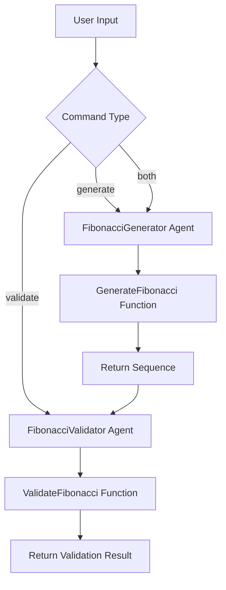

# Fibonacci Multi-Agent Workflow

This project demonstrates a declarative multi-agent workflow using the Semantic Kernel Agent Framework to generate and validate Fibonacci sequences.

## Overview

The application implements two specialized AI agents that collaborate to:

1. **Generate** the first 10 Fibonacci numbers
2. **Validate** that the generated sequence is correct

## Architecture

### Multi-Agent System

The system uses two specialized agents:

- **FibonacciGenerator**: Generates Fibonacci sequences using kernel functions
- **FibonacciValidator**: Validates Fibonacci sequences for correctness

### Key Components

1. **FibonacciApp.cs**: Main application orchestrating the multi-agent workflow
2. **FibonacciPlugin.cs**: Kernel plugin containing Fibonacci-related functions
3. **FibonacciAgentInstructions.cs**: Agent instruction definitions
4. **MockChatCompletionService.cs**: Mock chat completion service for demonstration
5. **fibonacci-agents.yaml**: Declarative YAML agent definitions (reference)

## Agent Workflow



## Available Functions

### FibonacciPlugin Functions

- **GenerateFibonacci(count)**: Generates first N Fibonacci numbers
- **ValidateFibonacci(sequence)**: Validates a sequence for Fibonacci correctness
- **GetFibonacciString(count)**: Returns formatted string of Fibonacci numbers
- **IsFibonacciNumber(number)**: Checks if a number is a Fibonacci number

## Setup

### Azure OpenAI Configuration

Before running the application, you'll need to configure Azure OpenAI settings. See the [Azure OpenAI Setup Guide](AZURE_OPENAI_SETUP.md) for detailed instructions on:

- Setting up your Azure OpenAI service
- Configuring API keys and endpoints
- Updating the `appsettings.json` file

## Usage

1. Build and run the application:

   ```bash
   dotnet build
   dotnet run
   ```

2. Choose option `2` for "Fibonacci Multi-Agent Workflow"

3. Available commands:
   - `generate` - Generate first 10 Fibonacci numbers
   - `validate` - Validate the generated sequence
   - `both` - Generate and validate in sequence
   - `exit` - Exit the application

## Example Interaction

```text
=== Fibonacci Multi-Agent Workflow ===
Available commands:
- 'generate' - Generate first 10 Fibonacci numbers
- 'validate' - Validate the generated sequence
- 'both' - Generate and validate
- 'exit' - Exit the application

What would you like to do? both

🔢 Generating Fibonacci sequence...
Generator: The first 10 Fibonacci numbers are: 0, 1, 1, 2, 3, 5, 8, 13, 21, 34

✅ Validating Fibonacci sequence...
Validator: ✅ VALID: The sequence [0, 1, 1, 2, 3, 5, 8, 13, 21, 34] is a correct Fibonacci sequence.
```

## Declarative Agent Definitions

The `fibonacci-agents.yaml` file demonstrates how these agents could be defined declaratively using YAML format, following the Semantic Kernel Agent Framework patterns:

```yaml
generator_agent:
  type: chat_completion_agent
  name: FibonacciGenerator
  description: Specialist agent for generating Fibonacci sequences
  instructions: |
    You are a Fibonacci sequence generator specialist...
  tools:
    - id: GenerateFibonacci
      type: function
      description: Generates the first N numbers of the Fibonacci sequence
```

## Key Features Demonstrated

1. **Multi-Agent Collaboration**: Two specialized agents working together
2. **Tool/Function Calling**: Agents invoke C# methods via kernel functions  
3. **Declarative Configuration**: Agent definitions in structured format
4. **Interactive Workflow**: User-driven command execution
5. **Validation Logic**: Cross-validation between agents
6. **Plugin Architecture**: Extensible function library

## Technical Implementation

- **Framework**: Microsoft Semantic Kernel Agent Framework
- **Language**: C# with .NET 9.0
- **Pattern**: Multi-agent orchestration with specialized roles
- **Architecture**: Plugin-based function calling with mock chat completion

This implementation showcases modern AI agent patterns using the latest Semantic Kernel features, demonstrating how multiple AI agents can collaborate to solve complex tasks through structured workflows and function calling capabilities.
